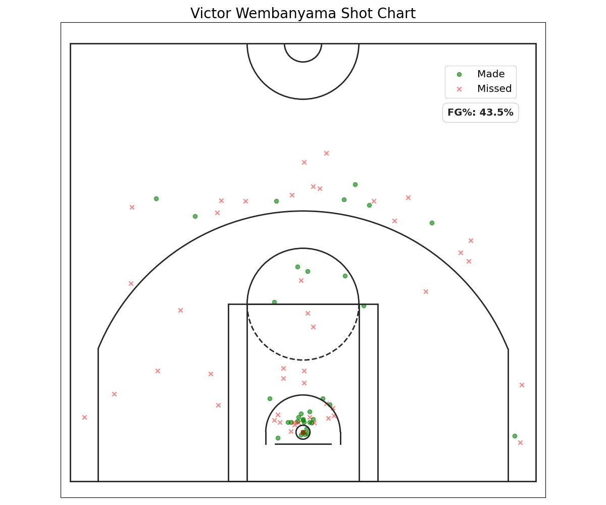
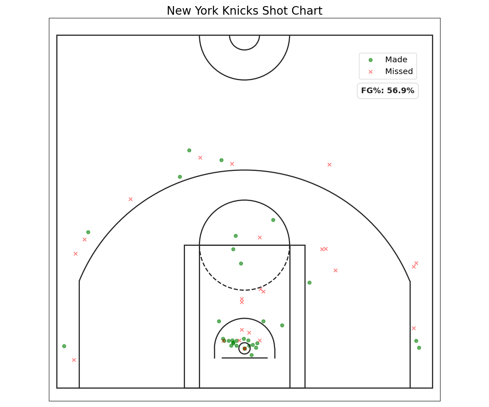
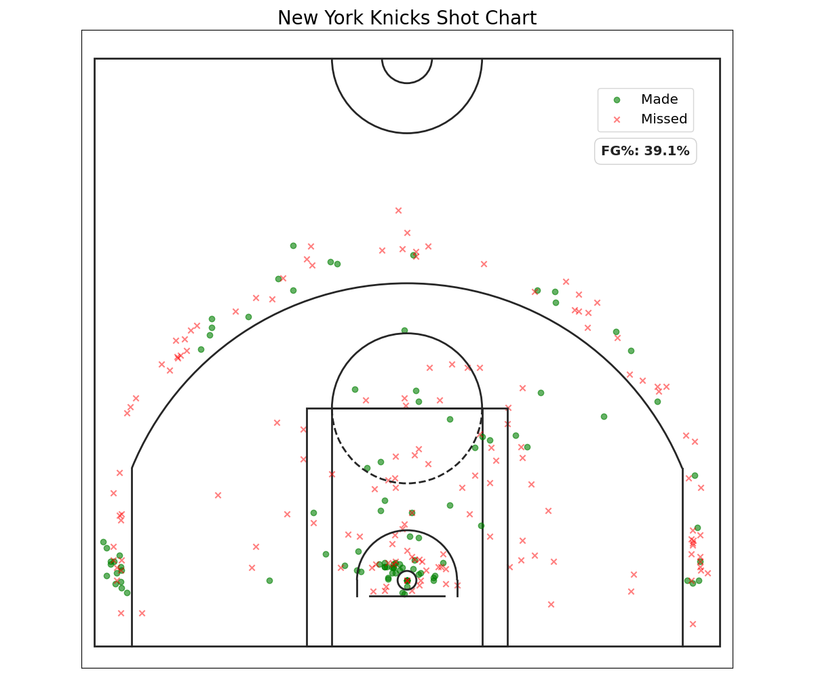

# The Wemby Effect

A small project that analyzes how Victor Wembanyama affects shot selections, by specifically looking at shot charts from the New York Knicks in the 2025-26 NBA Finals, alongside Wembanyama's own shot selection in that Finals series. 

## Setup and Usage

```bash
pip install pandas matplotlib nba_api
python knicks_vs_wemby.py
python wemby_shot_chart.py
```

## Visualizations

### 1. Victor Wembanyama's Playoff Shot Chart


### 2. Knicks Shot Chart (Wemby Off-Court)


### 3. Knicks Shot Chart (Wemby On-Court)

(Because Victor Wembanyama usually hugs the right side of the court, the corner
three from the left is more effective than other shots)

